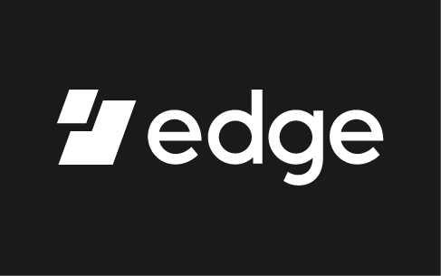

# Edge Brand Guide and Assets

 

### Table of Contents
1. [Logo](#logo)
2. [Colors](#colors)
3. [Screenshots](#screenshots)
4. [Banners](#banners)
5. [Edge Social Links](#edge-social-links)

 
 

## Logo

### Edge Primary Logo:
These are the primary logo variations that should be used across product and marketing. 

| Mint + Navy logo—use for light bg | Mint + White logo—use for dark bg |
| :-------------: |:-------------:|
|  |  |
| [Download Hi-Res Logo](./Logo/Primary/Edge_Primary_Logo_MintNavy.png)| [Download Hi-Res Logo](./Logo/Primary/Edge_Primary_Logo_MintWhite.png)|

 

### Edge Secondary Logo:
Use secondary logos if primary logos are over background colors that clash. 

| Navy | White |
| :-------------: |:-------------:|
|  |  |
| [Download Hi-Res Logo](./Logo/Secondary/Edge_Secondary_Logo_Navy.png)| [Download Hi-Res Logo](./Logo/Secondary/Edge_Secondary_Logo_White.png)|

 

### Edge Mark:

| Mint | Navy | White |
| :-------------: |:-------------:|:-------------:|
|  |  | 
| [Download Hi-Res Mark](./Logo/Mark/Edge-Final-Logo_Mark-Green.png)| [Download Hi-Res Mark](./Logo/Mark/Edge-Final-Logo_Mark-Blue.png)| [Download Hi-Res Mark](./Logo/Mark/Edge-Final-Logo_Mark-White.png)|

 

### Edge App Icon:

 
 

## Colors

### Primary Palette:

| Edge Navy | Edge Mint | Edge Blue |
|-------------|-------------|-------------|
|  |  | | 
| HEX: 0D2145 | HEX: 66EDA8 | HEX: 0E4B75 |
| CMYK: 100 89 42 46 | CMYK: 50 0 50 0 | CMYK: 98 73 31 15 |
| RGB: 13 33 69 | RGB: 102 237 168 | RGB: 14 75 117 |

 

### Secondary Palette:

| Accent Blue | Accent Orange | Accent Red |
|-------------|-------------|-------------|
|  |  | | 
| HEX: 0073D9 | HEX: F1AA19 | HEX: E85466 |
| CMYK: 82 54 0 0 | CMYK: 4 36 100 0 | CMYK: 4 82 50 0 |
| RGB: 0 115 217 | RGB: 241 170 25 | RGB: 232 84 102 |

 

### Grays:

| Gray01 | Gray02 | Gray03 | Gray04 |
|-------------|-------------|-------------|-------------|
|  |  | | |
| HEX: 4A5157 | HEX: 87939E | HEX: D9E3ED | HEX: F4F5F6 |
| CMYK: 70 58 51 32 | CMYK: 51 35 31 1 | CMYK: 13 6 3 0 | CMYK: 3 2 2 0 |
| RGB: 74 81 87 | RGB: 135 148 158 | RGB: 217 227 237 | RGB: 96 245 246 |

 
 

## Screenshots

| Login | Wallets | Request | Edge Login |
|-------------|-------------|-------------|-------------|
|  |  | | |
| [Download Hi-Res Login Screenshot](./Screenshots/Devices/iOS/iPhone_Login.png) | [Download Hi-Res Wallets Screenshot](./Screenshots/Devices/iOS/iPhone_Wallets.png) | [Download Hi-Res Request Screenshot](./Screenshots/iPhone_Request.png) | [Download Hi-Res Edge Login Screenshot](./Screenshots/iPhone_EdgeLogin.png) |

### Screens Only

| Wallet Type, Exchange, Transaction | Exchange, Wallet List, Transaction | Wallet List, Request, Transaction | Tokens, Wallet List, Select Wallet |
|-------------|-------------|-------------|-------------|
|  |  |  | 
| [Download Hi-Res Login Screenshot](./Screenshots/Edge_SetofScreens1.png) | [Download Hi-Res Login Screenshot](./Screenshots/Edge_SetofScreens2.png) | [Download Hi-Res Login Screenshot](./Screenshots/Edge_SetofScreens3.png) | [Download Hi-Res Login Screenshot](./Screenshots/Edge_SetofScreens4.png)

 
 

## Banners

| Banner1 | Banner2 | 
|-------------|-------------|
|  |  |
| [Download Hi-Res Banner1](./Banners/Edge_banner_bg.png) | [Download Hi-Res Banner2](./Banners/Edge_banner_long.png) | 

 
 

## Social Links
Website: https://edge.app  
App Store: https://itunes.apple.com/us/app/edge-crypto-bitcoin-wallet/id1344400091?mt=8  
Play Store: https://play.google.com/store/apps/details?id=co.edgesecure.app  
Twitter: https://twitter.com/EdgeWallet 
Facebook: https://www.facebook.com/EdgeWallet 
YouTube: https://youtube.com/c/EdgeWallet 
Instagram: https://www.instagram.com/EdgeWallet/ 
LinkedIn: https://www.linkedin.com/company/edgeapp 
Angellist: https://angel.co/edgesecure
